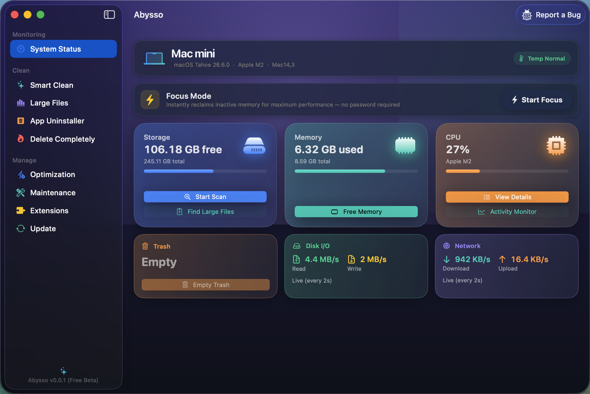
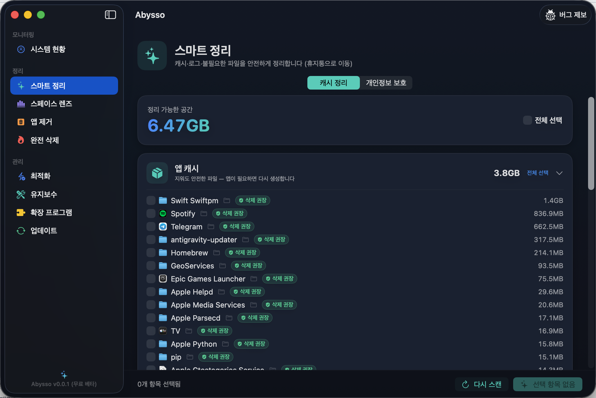
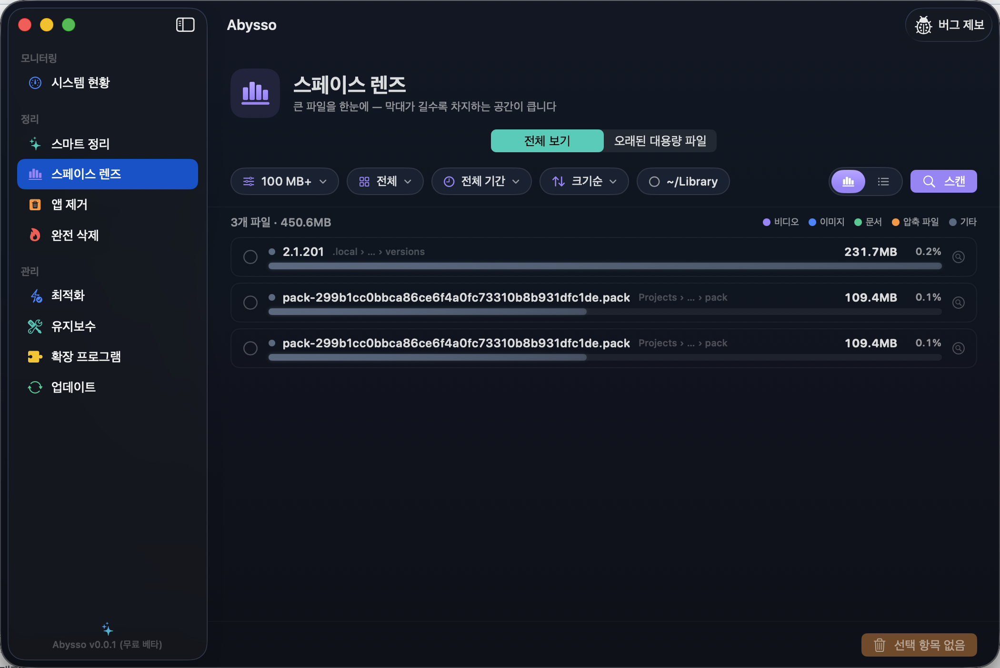
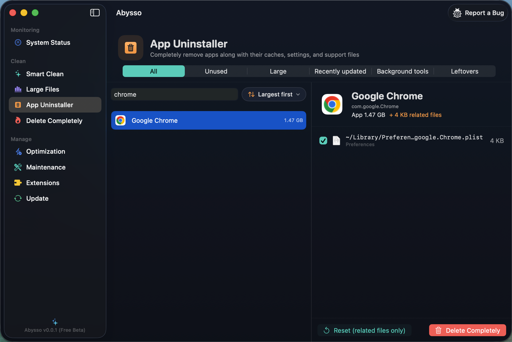
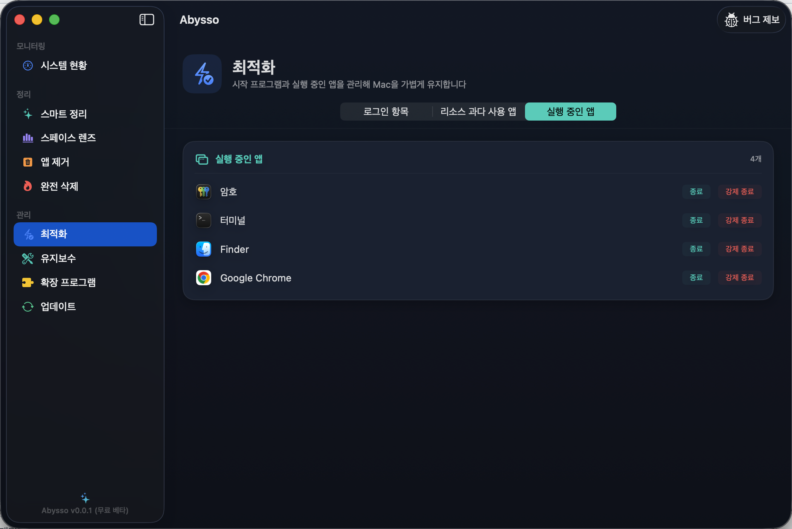

# Abysso

**완전 무료** macOS 개인 정리 유틸리티. 캐시·대용량 파일·앱 잔여물을 안전하게 찾아 정리한다. 계정·구독 없이 모든 기능을 무료로 쓸 수 있고, 모든 삭제는 휴지통을 거치며(완전 삭제 제외), 다크 전용 테마와 7개 언어 UI를 지원한다.

- **버전:** v0.0.1 (Free Beta)
- **번들 ID:** `app.abysso.mac`
- **플랫폼:** macOS (Apple Silicon), SwiftUI + Swift Package Manager
- **도메인:** [abysso.app](https://abysso.app)



## 주요 기능

사이드바 3섹션 9탭 구성.

| 섹션 | 탭 | 설명 |
|------|-----|------|
| 모니터링 | **시스템 현황** | CPU·메모리·디스크 실시간 대시보드 (링 게이지 + 글래스 카드) |
| 정리 | **스마트 정리** | 캐시·로그·깨진 다운로드 정리 + 개인정보 보호(방문 기록·쿠키) |
| 정리 | **대용량 파일** | 큰 파일을 용량순 막대 차트로 시각화 (전체 보기 / 오래된 대용량 파일) |
| 정리 | **앱 제거** | 앱과 관련 잔여 파일까지 함께 제거 |
| 정리 | **완전 삭제** | 복구 불가능하게 파일 파쇄 |
| 관리 | **최적화** | 로그인 항목·리소스 과다·실행 중인 앱 관리 |
| 관리 | **유지보수** | 시스템 유지보수 작업 |
| 관리 | **확장 프로그램** | 브라우저·시스템 확장 관리 |
| 관리 | **업데이트** | 앱·Homebrew·OS 업데이트 확인 |

그 외: 메뉴 막대 어시스턴트(팝오버), 로그인 시 자동 실행, RAM 부족 알림, Sparkle 자동 업데이트.

## 스크린샷

**스마트 정리** — 캐시·로그를 카테고리별로 스캔하고 안전도 뱃지로 삭제 위험을 표시



**대용량 파일** — 큰 파일을 용량순 막대 차트로 시각화하고, 알아보기 힘든 파일의 정체를 함께 표시(예: "Git 저장소 데이터")



**앱 제거** — 앱과 함께 남는 캐시·설정·지원 파일까지 한 번에 제거 (검색으로 앱을 골라 상세 확인)



**최적화** — 로그인 항목·리소스 과다·실행 중인 앱 관리



## 언어

한국어 · English · 日本語 · 繁體中文 · Deutsch · Español · Français (7개 언어)

`Resources/{ko,en,ja,zh-Hant,de,es,fr}.lproj/Localizable.strings`. 영어(`en`) 파일이 전체 키의 슈퍼셋 템플릿이며, 번역 정합성은 `python3 validate_strings.py`로 검사한다.

## 빌드

Xcode 없이 커맨드라인 도구 + SPM으로 빌드한다.

```bash
./build-app.sh          # build/Abysso.app 생성 (ad-hoc 서명) + /Applications 동기화
./create-dmg.sh         # 배포용 DMG 생성
swift Tools/make-icon.swift   # 앱 아이콘 재생성
```

## 프로젝트 구조

```
Sources/Abysso/       # 앱 소스 (SwiftUI 뷰 + 모델, 31개 파일)
  AbyssoApp.swift     # 앱 진입점 + AppDelegate (메뉴 막대, 상단 메뉴 정리)
  ContentView.swift   # 사이드바 + 탭 라우팅, 모델 소유
  CacheView.swift     # 스마트 정리
  LargeFilesView.swift# 대용량 파일 (병렬 스캔)
  Theme.swift         # 다크 테마 + 공용 컴포넌트
  ...
Resources/*.lproj/    # 다국어 문자열
Tools/                # 아이콘·DMG 배경 생성기
Info.plist            # 번들 설정 (Sparkle 공개키 등)
build-app.sh          # 빌드 스크립트
validate_strings.py   # 번역 키 정합성 검사기
```

## 릴리스 (Sparkle 자동 업데이트)

1. `Info.plist`의 버전을 올린다
2. `./create-dmg.sh`로 DMG 생성
3. `sign_update <dmg>`로 서명
4. `appcast.xml`의 `enclosure`(edSignature, length) 갱신 → `https://abysso.app/appcast.xml`에 배포

> EdDSA 개인키는 로그인 키체인에 있으며 **재생성 금지** — 재생성하면 기존 배포본이 업데이트되지 않는다.

---

개인 프로젝트 · 비공개 저장소
